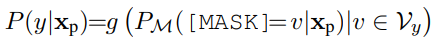

# Knowledgeable Prompt-tuning: Incorporating Knowledge into Prompt Verbalizer for Text Classification

jtwang	2022/10/25

>*Hu, Shengding, et al. "Knowledgeable Prompt-tuning: Incorporating Knowledge into Prompt Verbalizer for Text Classification." Proceedings of the 60th Annual Meeting of the Association for Computational Linguistics (Volume 1: Long Papers). 2022.*

---
## Abstract

- 针对文本分类问题，在low-data场景下
- Prompt-tuning优于fine-tuning with extra classifiers
- Prompt-tuning的核心思想是：将文本插入模板templete，作为PLM（预训练语言模型，pre-trained language model）的输入。从而将文本分类问题 $\rightarrow$ masked language modeling（完形填空）。
- Prompt-tuning的关键在于：构建label space和label word space之间的映射，即verbalizer。
- 之前的工作都是人工构建或者通过梯度下降搜索得到的，存在着如下问题
  - Lack coverage
  - Bias and high variances
- 本文将external knowledge引入到verbalizer的构建过程中，提出knowledgeable prompt-tuning（KPT）
- 具体来说，
  - Expand the label word space
  - Refine the expanded label word space
- 源码
  >https://github.com/thunlp/KnowledgeablePromptTuning.

---
## Introduction

- PLM在预训练期间获得了大量的知识，如何stimulate and exploit这种知识吸引了众多研究者
- Fine-tuning：添加额外的分类器on the top of PLM，进一步训练模型。这种方式仍需要大量训练数据，在小样本场景下不适用
- 自从GPT-3和LAMA，涌现了一系列使用prompts的研究工作。这种方法bridge the gap between pre-training objective and down-stream tasks（预训练目标与下游任务），在零样本和小样本场景下取得了很好的表现
- A typical way to use prompts is to wrap the input sentence into a natural language **template** and let the PLM conduct **masked language modeling**。例如，对于
  - 句子$\mathbf{x}$：`What’s the relation between speed and acceleration?`
  - 要将其分类为`SCIENCE` category
  - 使用模板：`A [MASK] question: x`
  - 将分类概率转换为：PLM预测`[MASK]`处是单词`"science"`的概率
  - **Verbalizer**：映射label words $\rightarrow$ class（vocabulary $\rightarrow$ label space）

- 目前有两种方法构建Verbalizer
  - 人工，成本大。
  - learned-from-scratch：使用discrete search或者gradient descent。缺少human prior knowledge，效果很差

##### Motivation
- 人工设计的one-one mapping限制了label word space的范围并引入了bias，在上一个例子中，`{science}→ SCIENCE`，忽略了“physics” and “maths”这些同样相关的词语。这说明label words的语义信息很重要。
- Optimization-based expansion只能产生label的同义词，不能跨粒度，如从“science”到“physics”
- 如果能构建出`{science, physics}→ SCIENCE`这样的verbalizer，无疑能增强模型的预测效果
- 为了improve the coverage and reduce the bias of the manual verbalizer，本文提出了knowledgeable prompt-tuning (KPT)，incorporate external knowledge into the verbalizers to facilitate prompt-tuning

##### Methods
- KPT包含3步
  - Construction：使用外部生成label words for each label。不仅仅生成同义词，还包含不同粒度和角度的词汇
  - Refinement：过滤，提出了4种方法：frequency/relevance/contextualized/learnable refinement
  - Utilization：采用average/weighted loss，scores on a set of label words $\rightarrow$ scores of the labels

---
## KPT
- 符号
  - Pre-trained language model: $\mathcal{M}$
  - Input sequence: $\mathbf{x}=(x_0, x_1, ...,x_n)$
  - Class label: $y\in \mathcal{Y}$
  - Templete: $\mathbf{x_p}$ = $\mathrm{[CLS]}$ A $\mathrm{[MASK]}$ question : $\mathbf{x}$
  - Verbalizer: $f: \mathcal{V}\mapsto \mathcal{Y}$
  - Subset of $\mathcal{V}$ that is mapped into a specific label $y$: $\mathcal{V}_y$
  - The probability of each word $v$ in the vocabulary being filled in $\mathrm{[MASK]}$ token: $P_\mathcal{M}(\mathrm{[MASK]}=v|\mathbf{x_p})$
  - The probability of label $y$: $P(y|\mathbf{x_p})$  
      

---
## 一些思考
- 采用贯穿全文始末的例子说明motivation、本文方法的优越性，文章的整体性会更强，对于读者来说也更直观易懂
