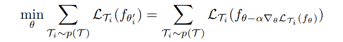
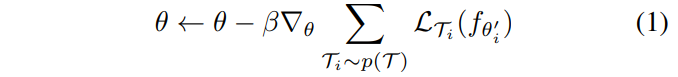
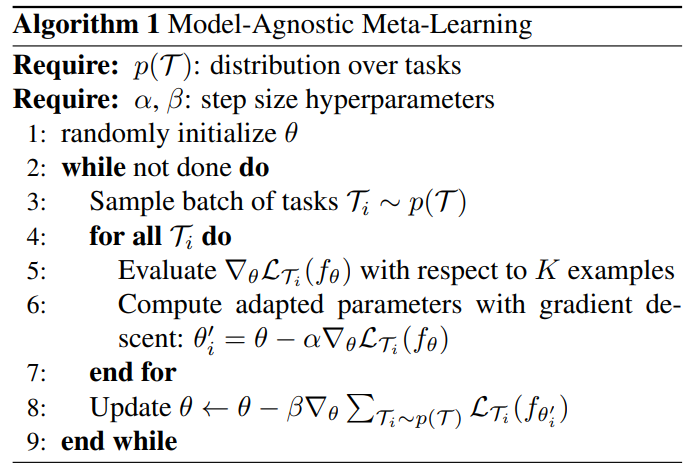

# Model-Agnostic Meta-Learning for Fast Adaptation of Deep Networks

jtwang 2022/11/29

> Finn C, Abbeel P, Levine S. Model-agnostic meta-learning for fast adaptation of deep networks[C]//International conference on machine learning. PMLR, 2017: 1126-1135.
> 论文链接：http://proceedings.mlr.press/v70/finn17a/finn17a.pdf

元学习经典工作MAML。学习初始化梯度。训练目标非常简单明了，这么高的引用量，惊了。

## Abstract
- 提出一个元学习的算法，它是model-agnostic，与任何用梯度下降训练的模型都兼容，适用于不同的学习任务，包括分类、回归、强化学习
- 元学习的目标是在variety任务上训练一个模型，such that 这个模型仅利用几个训练样本就可以解决新的任务
- In our approach, the parameters of the model are explicitly trained such that a small number of gradient steps with a small amount of training data from a new task will produce good generalization performance on that task.
- In effect, our method trains the model to be easy to fine-tune. 我们的方法让模型易于微调

## Introduction
- 在元学习中，训练模型的目标是quickly learn a new task from a small amount of new data, 模型被meta-learner训练，可以在大量的不同的任务上学习。
- MAML 的核心思想是：训练模型的初始化参数，使得模型在新的任务上使用很少的样本，进行一次或几次梯度下降就可以取得最优表现。

## Model-Agnostic Meta-Learning
- In effect, we will aim to find model parameters that are sensitive to changes in the task, such that small changes in the parameters will produce large improvements on the loss function of any task
- 梯度下降公式
  

- Meta objective，让初始化参数更优，仅通过一步或几步梯度下降就可适应新的任务。 In effect, our proposed method aims to optimize the model parameters such that one or a small number of gradient steps on a new task will produce maximally effective behavior on that task.
  

- 使用SGD随机梯度下降求解$\theta$
  

- MAMAL算法
  

