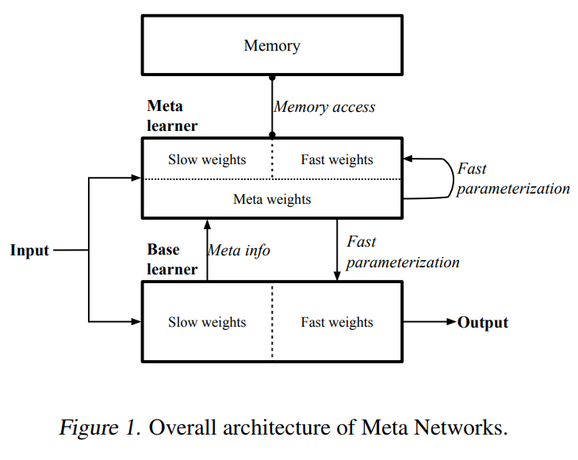

# Meta Networks

jtwang  2022/11/8

> Munkhdalai, Tsendsuren, and Hong Yu. "Meta networks." International Conference on Machine Learning. PMLR, 2017.
> 论文地址：http://proceedings.mlr.press/v70/munkhdalai17a/munkhdalai17a.pdf

看不懂呀看不懂。。。

---
## Abstract
我们提出一个新的元学习方法MetaNet，学习a meta-level knowledge across tasks and shifts its inductive biases via fast parameterization for rapid generalization. 
在Omniglot和Mini-ImageNet数据集上做了评估。
MetaNet与generalization和continual learning相关。

---
## Introduction
- 当有大量的标记数据可供训练时，深度神经网络已在多个应用领域显示出巨大的成功。然而，这种大规模训练数据的可用性通常是大多数学习任务的先决条件。
此外，标准的深度神经网络缺乏**持续学习**或动态**增量学习**新概念的能力，而不会忘记或破坏先前学习过的模式。相比之下，人类可以从相同概念的几个例子中快速学习和归纳。人类也非常擅长增量(即持续)学习。这些能力大多可以用大脑中的元学习来解释（learning to learn）。

- 先前的工作将元学习表示为two-level learning。The goal of a meta-level learner is to acquire generic knowledge of different tasks. The knowledge can then be transferred to the base-level learner to provide generalization in the context of a single task. The base and meta-level models can be framed in a single learner or in separate learners.
  1. low learning of a **meta-level** model performing across tasks.
  2. rapid learning of a **base-level** model acting within each taks

- 我们提出一个元学习模型MetaNet（Meta networks），支持meta-level continual learning by allowing neural networks to learn and to generalize a new task or concept from a single example on the fly. MetaNet包含:
  1. base learner, in the input task space
  2. meta learner, in a task-agnostic meata space
  3. memeory，for rapid learning and generalization

 

- Meta learner在meta sapce工作，支持持续学习，并跨不同任务获取元知识；base lerner首先对输入任务进行分析。然后，向meta learner提供a feedback in the form of higher order meta information，以解释自身在当前任务空间中的状态。基于meta information，meta learner可以快速参数化自身和base lerner，使得MetaNet能够识别输入任务的新概念。

- MetaNet的训练权值在不同的时间尺度上演化：
    1. standard **slow weights** are updated through a learning algorithm (i.e. REINFORCE)
    2. **task-level fast weights** are updated within the scope of each task
    3. **example-level fast weights** are updated for a specific input example

- 本文采用**loss gradients**作为meta information。 MetaNet有两种损失函数：
  1. representation (embedding) loss for the good representaion learner criteria
  2. main (task) loss for the input task objective

- 我们广泛地研究了MetaNet在几种不同设置下对one-shot supervised learning (SL)问题的性能和特性。我们提出的方法不仅改进了标准基准上的最新结果，而且显示了一些与 generalization和continual learning相关的有趣性质。

---
## Related Work

---
## Meta Networks
- MetaNet通过处理high-order元信息，快速参数化底层的神经网络，可以适用于具有不同输入和输出分布的任务序列。MetaNet包含2个学习模块：
  1. Meta learner is responsible for fast weight generation by operating across tasks
  2. Base learner performs within each task by capturing the task objective

- 生成的fast weights送至base & meta learner to shift the inductive bias of the learners （What is inductive bias???）

- 我们还提出了layer augmentation方法，将standard slow weights和task/example specific fast weights融合在一个神经网络中。

- 任务设定同[1]。每个任务包含一个support set和一个training set，它们的类标签是一致的；不同任务的标签不同。

- **训练**过程包含3步：
  1. acquisition of meta information
  2. generation of fast weights
  3. optimization of slow weights

- 为了**测试**MetaNet在one-shot SL问题，我们从测试集中采样出另一些任务，这些任务的class是未知的。模型需要基于支持集对测试样本分类。
- 我们假设在训练和测试阶段，support set的标签都是已知的。在one-shot设定中，每个类别的支持集仅包含一个样本。

####符号
- support set：$\{x_i',y_i'\}_{i=1}^N$
- training set：$\{x_i,y_i\}_{i=1}^L$
- fast weights: $\{W_i^*\}_{i=1}^N$
- loss gradient: $\{\nabla_i\}_{i=1}^N$
- Dynamic representation learning function: $u$
- Fast weight generation functions: $m$, $d$
- Memory: $M={W_i^*}_{i=1}^N$
- slow weights: $Q$
- task-level fast weights: $Q^*$
- example-level fast weights: $\{W_i^*\}_{i=1}^N$
- slow weight: $W$
- embedding of sample $\{x_i'\}_{i=1}^N$: $R=\{r_i'\}_{i=1}

#### Meta Learner
- Meta learner包含
  - Dynamic representation learning function $u$，目标是表示学习，通过使用task-level fast weights在每个任务空间中构建embeddings of inputs
  - Fast weight generation functions $m$ and $d$，处理元信息，生成example和task-level fast weights

- 更具体地，$m$学习从loss gradient $\{\nabla_i\}_{i=1}^N$（由base learner生成）到fast weights $\{W_i^*\}_{i=1}^N$的映射。$m$是一个神经网络，$Z$是其参数。
$$W_i^*=m(Z,\nabla_i)$$

- fast weights存储在memory中，$M={W_i^*}_{i=1}^N$。它以样本嵌入作为索引$R=\{r_i'\}_{i=1}^N$

- $u$学习支持集样本$\{x_i'\}_{i=1}^N$的嵌入$R=\{r_i'\}_{i=1}^N$
- 表示学习函数$u$是一个神经网络，参数是slow weights $Q$和task-level fast weights $Q^*$，使用表示损失作为训练目标to获得梯度作为元信息。
$$L_i=loss_{emb}(u(Q,x_i'),y_i') \\
\nabla_i=\nabla_QL_i \\
$$

- 生成fast weights $Q^*$，$d$表示一个神经网络，参数为$G$，它的输入大小是可变的。首先，从支持集中采样$T$个样本，$\{x_i',y_i'\}_{i=1}^T, (T<N)$，计算loss gradient作为元信息。然后，$d$将每个样本的梯度，汇集为task specific parameters $\{r_i'\}_{i=1}^N$。本文采用LSTM for $d$。
$$Q^*=d(G,\{\nabla\}_{i=1}^T)$$

- 一旦生成fast weights，计算task dependent input representations $\{r_i'\}_{i=1}^N$
$$r_i'=u(Q,Q^*,x_i')$$

- $loss_{emb}$与主任务损失$loss_{task}$不必相同。但是$loss_{emb}$要能捕获表示学习目标。当支持集仅有一个样本是我们采用cross-entropy loss。支持集有多个样本采用contrastive loss，在这种情况下，随机采样$T$对观察梯度，损失为：
$$L_i=loss_{emd}(u(Q,x_{1,i}'), u(Q,x_{2,i}'), l_i)$$

- 一旦参数存储到memory $M$中，索引$R$也构建好，meta learner就采用fast weights $W_i^*$对base learner进行参数化：
  - 首先，通过动态表示学习网络$u$将输入$x_i$嵌入到任务空间中，获得$r_i$
  - 采用soft attention读取memory
  $$a_i=attention(R,r_i) \\
  W_i^*=norm(a_i)^\top M$$
    - $attention$计算memeory索引和输入嵌入之间的相似度，我们使用余弦相似度;
    - $norm$是一个归一化函数，我们使用softmax

#### Base learner

- 表示为$b$，是一个函数或者神经网路
- 通过任务损失$loss_{task}$评估main task目标
- $b$的参数为slow weight $W$ + example-level fast weights $W^*$
- slow weight $W$在训练期间通过一个学习算法更新，fast weights通过meta learner生成
- Base learner采用通过支持集获得的元信息表示，为meta learner提供有关新输入任务的反馈。由base learner生成的元信息，形式为loss gradient：
  $$L_i=loss_{task}(b(W,x_i'),y_i') \\
  \nabla_i=\nabla_WL_i$$
    - $L_i$是支持集样本$\{x_i',y_i'\}_{i=1}^N$的损失，$N$是支持集中样本的数量，在one-shot设定下N=1
    - $\nabla_i$是参数$W$的梯度，作为meta information
    - $loss_{task}$可以是任意形式，我们采用交叉熵损失

- $\nabla_i$送到meta learner，通过$m$生成fast weights $W^*$

## References
[1] Matching Networks for One Shot Learning