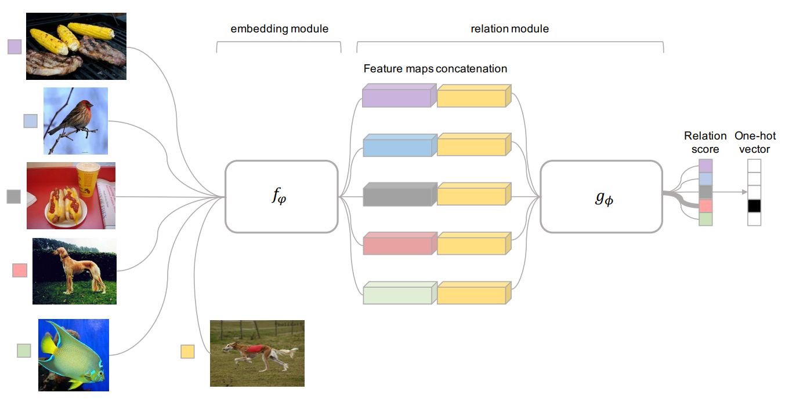
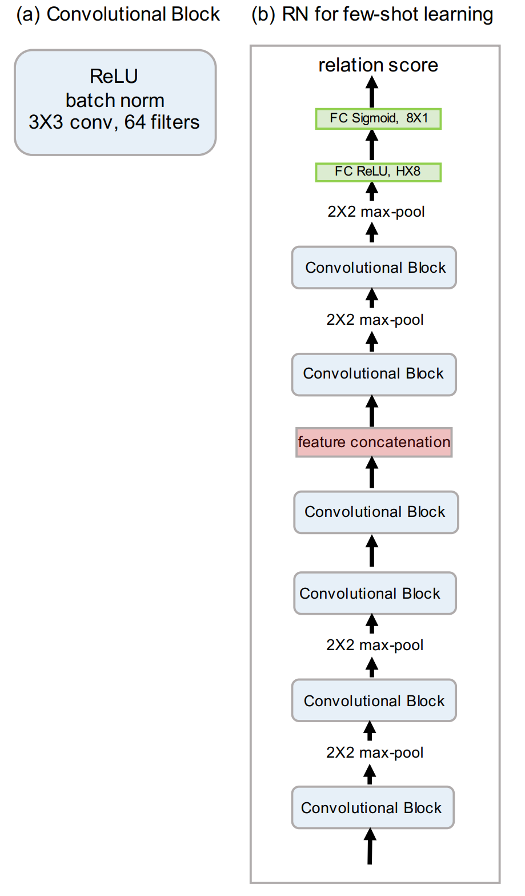
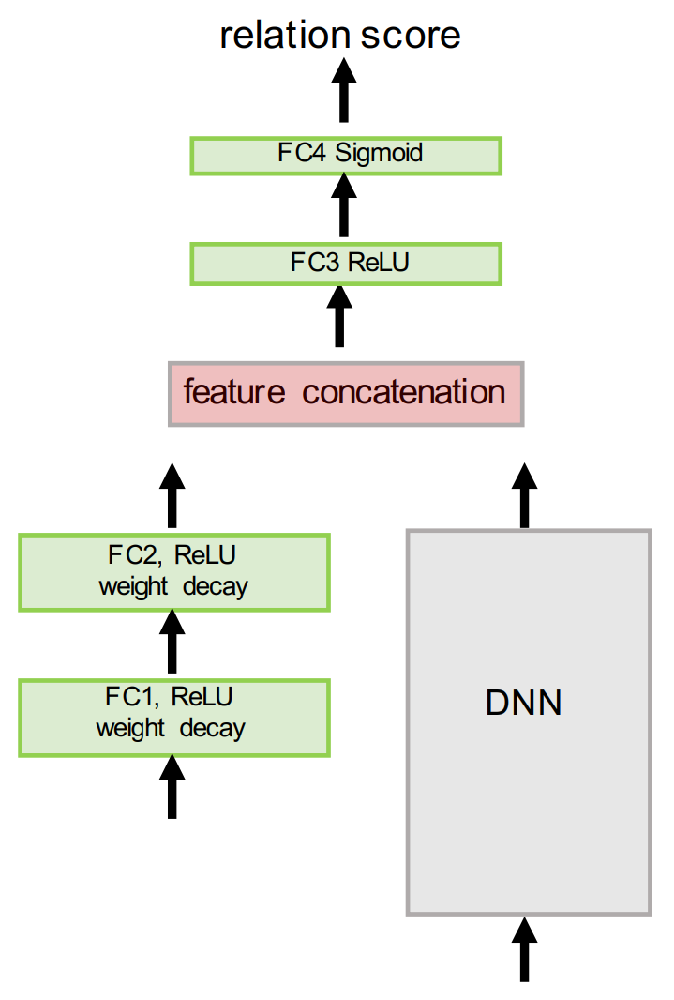

# Learning to Compare: Relation Network for Few-Shot Learning

jtwang 2022/11/30

> Sung F, Yang Y, Zhang L, et al. Learning to compare: Relation network for few-shot learning[C]//Proceedings of the IEEE conference on computer vision and pattern recognition. 2018: 1199-1208.
> 论文链接：https://openaccess.thecvf.com/content_cvpr_2018/papers/Sung_Learning_to_Compare_CVPR_2018_paper.pdf

Embedding + metric learning
  

#### 网络结构
Few-shot场景：卷积+全连接层
  

Zero-shot场景
  

